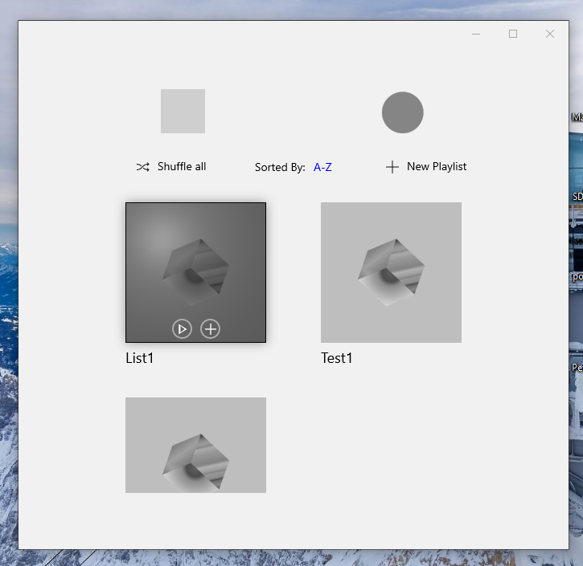
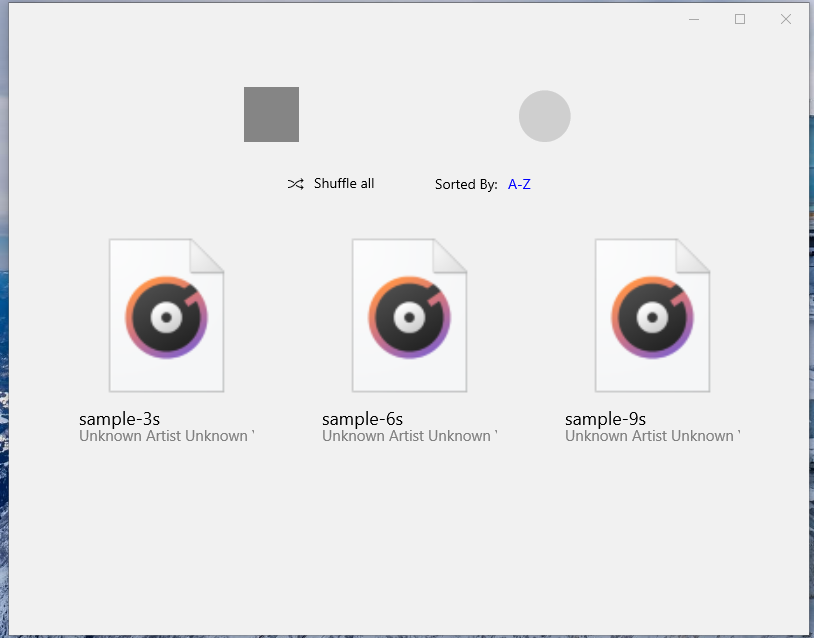
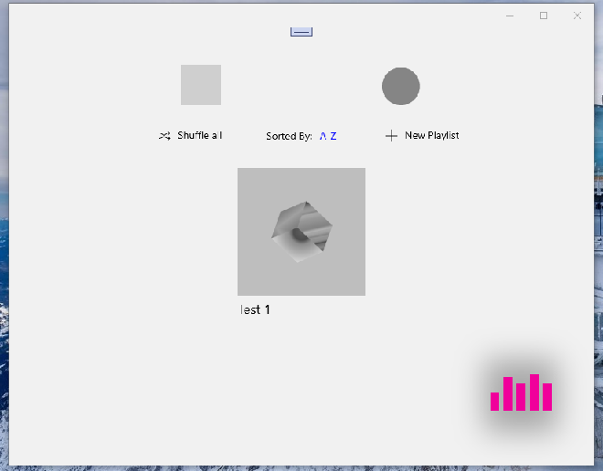
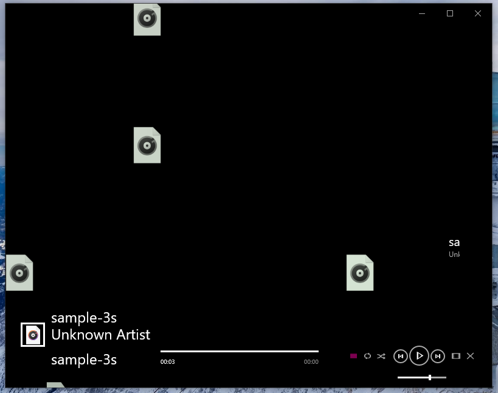

# Project Reborn Zune v1 alpha (tech num. 1.2.4)

## Words "forked" from author of Reborn Zune :)
"Glad you find this repo. If you've heard about Zune, you would be glad that this repo is all about 
combining the fasinating and attractive elements from Zune with Fluent design.
If not, I wish this repo, this app would provide you a new level of experience of music player app."

## My 2 cents
- UWP Codebase downgraded to SDK 15063 (!)
- Minimal bug workarounds / fixes
- RnD
- Refactoring (Test + Future .NET Core project moved to _A_ folder)

## Screenshots

### What is
This is a music player that plays local music files in your library. 
Thanks to the UWP community for providing so much useful and nice open source, 
we are able to bring the Tile wall from Zune to this app

### What is not
Although this project named as Reborn Zune, this is not a full porting version of Zune on UWP, 
aka having the same user interface, same information hierachy, same experience, etc.

One of the reasons is that although Zune is known about its user interface, 
we should recognize that the rich online music resources also complete the experience of Zune.

In fact, the Zune-Reburn's author only bring the most attractive element, 
at least (by his/m opinion) it is the most attractive one on Zune, to this app. 
Of course, as a dev who really cares about user experience and UI design, 
there's no way to not having Fluent design implemented in a modern UWP app. 
During you usage, you would experience the combination of the old Metro Design 
and the modern Fluent Design.

## Environment
Target Version: 10.0.19041.0

Min Version: 10.0.17xxx.x (by now)

## The Original (Zune-Reburn at MS Store) 
http://www.microsoft.com/store/apps/9MWK5C8DFM1P

AS IS. RnD only. No support.

-- [m][e] 2022
